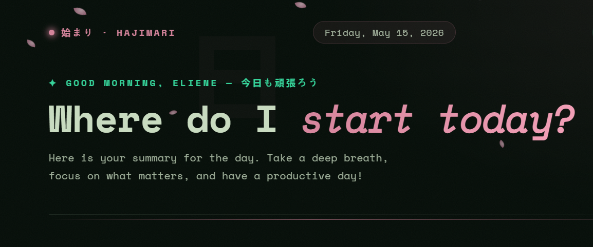

<div align="center">
  
  
  # 始まり · Hajimari Dashboard
  **Where do I start today?**

  A serene, dark-themed, start-of-day dashboard that integrates directly with your Google Workspace to give you a quick summary of what matters most: your unread emails, upcoming meetings, and pending tasks.

  [](#)
  [](#)
  [](#)
  [](#)
</div>

<br>

## ✨ Features

- **Google Workspace Integration:** Securely authenticate with your Google Account using the new Google Identity Services (GSI).
- **Gmail:** Displays the number of important unread emails you have and tracks your email volume over the last 7 days using Chart.js.
- **Google Calendar:** Tells you exactly when your next meeting is, so you don't miss a beat.
- **Google Tasks:** Keeps track of your pending tasks and highlights what is due today.
- **Zero Dependencies (Mostly):** Built purely with Vanilla HTML, CSS, and JS. The only external library is Chart.js for data visualization.
- **Beautiful UI:** A dark, immersive "shoji-inspired" theme with subtle micro-animations (falling sakura petals) and responsive design.

---

## 🚀 Getting Started

Since this project uses Google's OAuth2, it needs to be run on a local development server (opening the file directly via `file://` will cause authentication errors).

### Prerequisites
- You need a local server. If you have Python installed, you can easily spin one up:
  ```bash
  python -m http.server 8000
  ```
  *(Alternatively, you can use Node's `http-server` or the VSCode Live Server extension).*

### Running locally
1. Clone this repository:
   ```bash
   git clone https://github.com/your-username/dashboard-project.git
   cd dashboard-project
   ```
2. Start your local server in the project folder.
3. Open `http://localhost:8000` in your browser.

---

## ⚙️ Google Cloud Setup

To make the APIs work, you need to provide your own `CLIENT_ID` and enable the necessary APIs in the Google Cloud Console.

1. Go to the [Google Cloud Console](https://console.cloud.google.com/).
2. Create a new project.
3. Go to **APIs & Services > Library** and enable the following:
   - **Gmail API**
   - **Google Calendar API**
   - **Google Tasks API** *(Important: This is often disabled by default!)*
4. Go to **OAuth consent screen** and configure it. Make sure to add yourself as a test user if the app is in "Testing" mode.
5. Go to **Credentials**, click **Create Credentials**, and choose **OAuth client ID** (Web application).
   - Under **Authorized JavaScript origins**, add `http://localhost:8000` (or whatever URL you are using).
6. Copy your generated **Client ID**.
7. Open `script.js` in your text editor and replace the placeholder with your Client ID:
   ```javascript
   const CLIENT_ID = 'YOUR_CLIENT_ID_HERE.apps.googleusercontent.com';
   ```

---

## 📂 Project Structure

```text
├── index.html    # The main structure and layout
├── style.css     # Dark mode theme, animations, and responsive rules
├── script.js     # Google authentication and API fetching logic
└── layout.png    # Preview image for Open Graph/Twitter cards
```

## 🌐 Deploying

When deploying to a platform like GitHub Pages, Vercel, or Netlify:
1. Update your Google Cloud Console **Authorized JavaScript origins** with your live production URL (e.g., `https://your-username.github.io`).
2. Update the `index.html` Open Graph meta tags (like `og:url` and `og:image`) with your live absolute URL for proper social media sharing cards.

## 🤝 Contributing

Contributions, issues, and feature requests are welcome! Feel free to check the [issues page](#) if you want to contribute.

## 📜 License

This project is licensed under the MIT License - see the LICENSE file for details.
